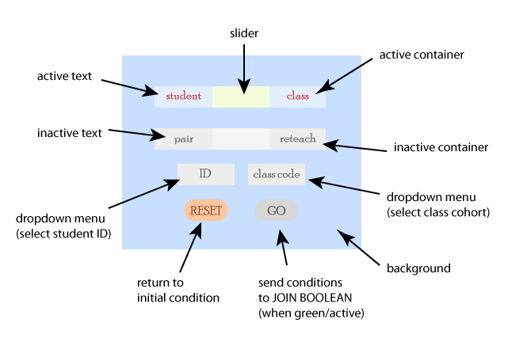
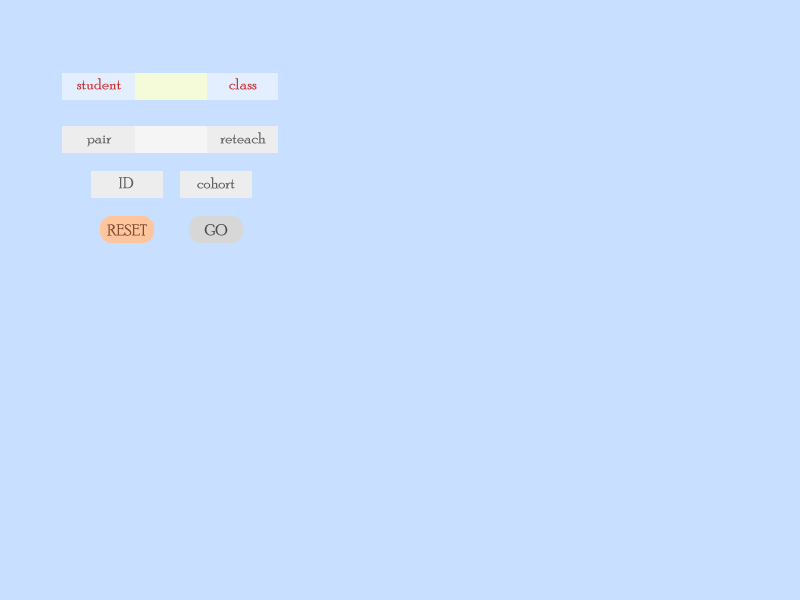
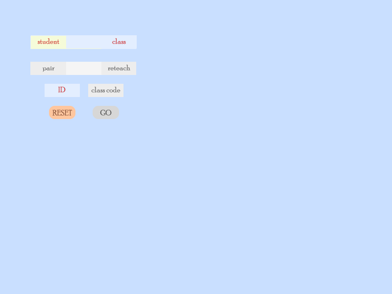
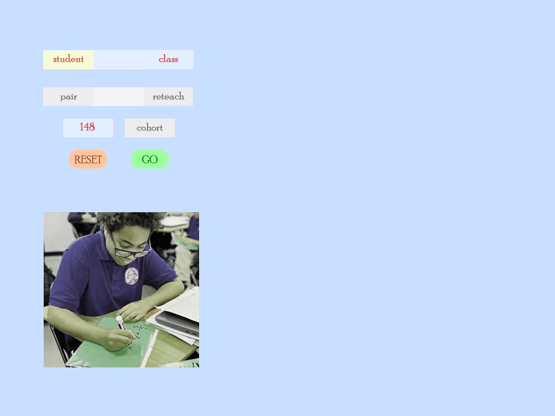
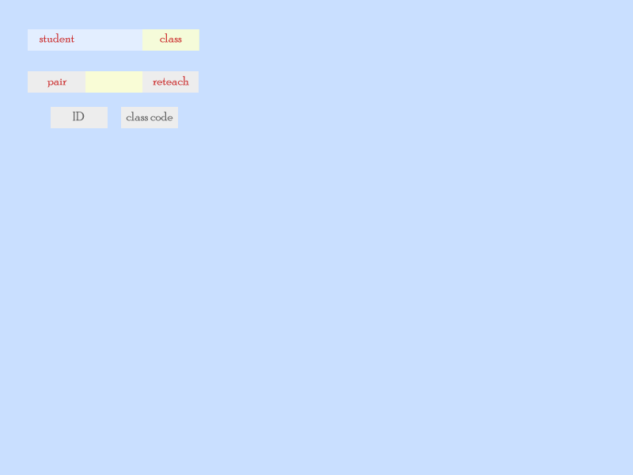
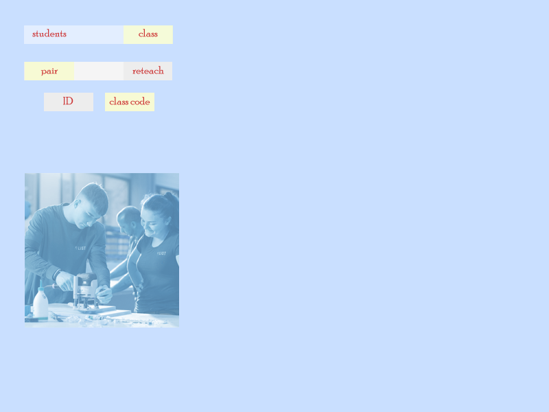
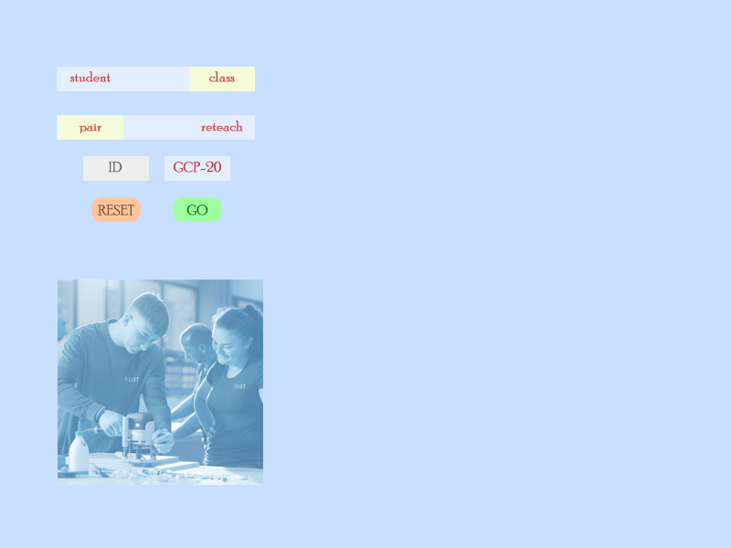
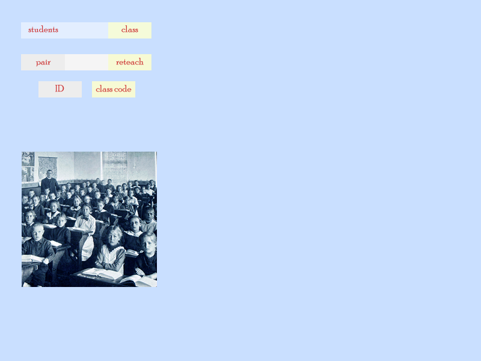
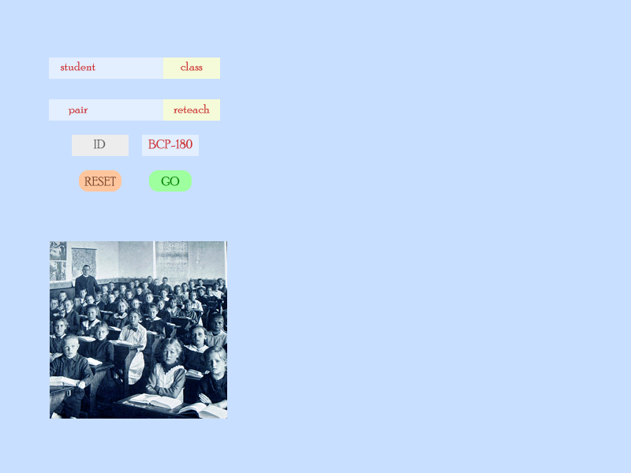

# Building a GUI for a teacher to choose how to analyze his students' assessed trades math homeworks.

The attached pngs wireframes sketch how the GUI should look like at various steps.  

This is what the CSS containers in the GUI should look like:

#### GUI Steps
Steps have an '@' character in front of them. 

@reset -> ├── @student -> @GO
          ├               
          ├── @class -> ├── @pair -> @GO
                        ├          
                        ├── @reteach -> @GO

#### CSS Element Descriptions
- Each element is surrounded by brackets [].
- *Italics* are teacher *gestures, swipe/click*
- **Bold** refers to a header code in <a href="dat/scores.csv">scores.csv</a>
- {} is an encoded *gesture*
- ALL CAPS are names of the affordances the teacher may choose from

##### Most elements have two {states}
1. INACTIVE (default): grey colors, *gestures* are INACTIVE
2. ACTIVE primary colors, *gestures* are ACTIVE

[background] Contains the entire browser window, is ALWAYS ACTIVE  
   Color:DeepSkyBlue, #00BFFF;

[reset button] This rounded box is ALWAYS ACTIVE.  When *clicked*, the app returns to @reset 
   background-color:LightSalmon, #FFA07A;
   color:LightCoral, #F08080;

[GO_button] This rounded box, when {state}=ACTIVE, the teacher can *click* on it, and pass {Condition_1}, {Condition_2} and {Condition_3} to the query described in <a href="JOIN.md">JOIN.md</a>
   IF {state}=INACTIVE, THEN
      background-color:Beige, #F5F5DC;
      color:DarkGray, #A9A9A9;
   IF {Condition_1}, {Condition_2} and {Condition_3} NOT NULL, THEN {state}=ACTIVE
      background-color:LightGreen, #90EE90;
      color:DarkSeaGreen, #8FBC8F;

[student] This text box is ALWAYS ACTIVE.
   background-color:transparent;
   color:Red, #FF0000;

[class] This text box is ALWAYS ACTIVE.
   background-color:transparent;
   color=Red, #FF0000;

[top_container] This rectangle box is ALWAYS ACTIVE.
   background-color:AliceBlue, #F0F8FF;

[pair] A text box 
   IF {state}=INACTIVE THEN
      background-color:transparent;
      color:DarkGray, #A9A9A9;
   IF {state}=ACTIVE THEN
      background-color:transparent;
      color=Red, #FF0000;

[cohort] A text box
   IF {state}=INACTIVE THEN
      background-color:transparent;
      color:DarkGray, #A9A9A9;
   IF {state}=ACTIVE THEN
      background-color:transparent;
      color=Red, #FF0000;

[second_container] A rectangle box
   IF {state}=INACTIVE THEN
      background-color:Ivory, #FFFFF0;
   IF {state}=ACTIVE THEN
      background-color:AliceBlue, #F0F8FF;

[ID_dropdown_menu] listing all **sID**s in <a href="dat/scores.csv">scores.csv</a>, from 101 to 255.
   IF {state}=INACTIVE THEN
      background-color:transparent;
      color:DarkGray, #A9A9A9;
   IF {state}=ACTIVE THEN
      background-color:transparent;
      color=Red, #FF0000;
      
[cohort_dropdown_menu] listing all the cohorts in the **class** field in <a href="dat/scores.csv">scores.csv</a> -- bcp-176;bcp-177;bcp-178;bcp-179;bcp-180;gcp-18;gcp-19;gcp-20
   IF {state}=INACTIVE THEN
      background-color:transparent;
      color:DarkGray, #A9A9A9;
   IF {state}=ACTIVE THEN
      background-color:transparent;
      color=Red, #FF0000;

[slider_1] rectangle is ALWAYS ACTIVE
   background-color:Yellow, #FFFF00;
   opacity:0.5;

[slider_2] is a rectangle
   IF {state}=INACTIVE THEN
      background-color:DarkGray, #A9A9A9;
      opacity:0.5;
   IF {state}=ACTIVE THEN
      background-color:Yellow, #FFFF00;
      opacity:0.5;

#### CSS Elements Layers

Top Layer:  [slider_1]; [slider_2]; [reset button]; [GO button]; [ID_dropdown_menu]; [cohort_dropdown_menu]; [student]; [class]; [pair]; [cohort]

Middle Layer: [top_container]; [second_container] 

Bottom Layer: [background] 

#### Nested CSS containers

IF second_container.state IS INACTIVE, THEN
   slider_2.state IS INACTIVE AND
   pair.state IS INACTIVE AND
   cohort.state IS INACTIVE

[slider_1], [student], and [class] are within [top_container]

#### Decision Steps from *Teacher Gestures*

When the app is opened OR [reset button] is *clicked*, THEN @reset

<step name="reset">The teacher able to *swipe* [top_slider] left/right, choosing @student/@class.

   {Condition_1} IS NULL
   {Condition_2} IS NULL
   {Condition_3} IS NULL

   GO_button.state IS INACTIVE
   second_container.state IS INACTIVE
   ID_dropdown_menu.state IS INACTIVE

This is what the GUI should look like:

</step>

<step name="student">IF the teacher chooses @student by *swiping* the [top slider] left, 
   THEN ID_dropdown_menu.state IS ACTIVE, 
   AND {Condition_1} IS 'Student'
   
   The teacher can *click* a unique ID which will set 
   {Condition_2} IS 'sID' AND 
   {Condition_3} IS TRUE

This is what the GUI should look like:

<example> IF the teacher *swipes* @student AND THEN *clicks* '148' from the [ID dropdown menu], THEN GO_button.state IS ACTIVE

This is what the GUI should look like:

</example>
</step>

<step name="class">IF the teacher selects @class from *swiping* the [top slider] right, 
   THEN second_slider.state IS ACTIVE, 
   AND {Condition_1} IS 'Class'
   
   The teacher can *swipe* [second_slider] left/right, choosing @pair/@cohort.

This is what the GUI should look like:

</step>

<step name="pair">IF the teacher selects @pair from *swiping* the [second slider] left, 
   THEN second_container.state IS ACTIVE, 
   AND {Condition_2} IS 'Pair'
   
   The teacher can *click* [cohort_dropdown_menu] which will set 
   {Condition_3} IS 'Cohort'

This is what the GUI should look like:

<example>IF the teacher *swipes* @pair, AND *clicks* 'GCP-20' from the [cohort dropdown menu], THEN GO_button.state IS ACTIVE,

This is what the GUI should look like:

</example>
</step>

<step name="reteach">If the teacher selects @reteach from *swiping* the [second slider] right, 
   THEN second_container.state IS ACTIVE,
   AND {Condition_2) IS 'Reteach'
   
   The teacher can *click* [cohort_dropdown_menu] which will set 
   {Condition_3} IS 'Cohort'

This is what the GUI should look like:

<example>if the teacher *swipes* @reteach, AND *clicks* 'BCP-180' from the [cohort dropdown menu], THEN GO_button.state IS ACTIVE,

This is what the GUI should look like:

</example>
</step>

<step name="GO"> [GO_button] is ONLY ACTIVE when
   {Condition_1}, {Condition_2} AND {Condition_3} ARE NOT NULL

   When ACTIVE, a picture will be visible:
      IF {Condition_2} IS SID THEN 
      IF {Condition_2} IS PAIR THEN
      IF {Condition_2} IS RETEACH THEN 

   when ACTIVE, the teacher can *click* on it, and pass {Condition_1}, {Condition_2} and {Condition_3} to the query described in <a href="JOIN.md">JOIN.md</a>

   Once the [GO_button] is *clicked* @return
</step>

<step name="return">
</step>
