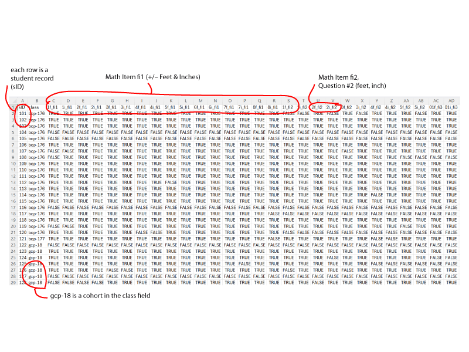

# Data Dictionary for scores.csv

#### NOTE: <a href="scores.csv">scores.csv</a> is a BOOLEAN table that only records whether the student got the question right or wrong.  Comparing the student's answer to the answer key has already been checked, so no actual answers (numbers) exist in this table.

- First row is the header, with each column in the header row is a unique *field code*, for example, **1f_fi1**.
- Each subsequent row is a *student record*, indexed by the first *field code*, **sID**.  Each **sID** *student record* is unique.
- The second *field code* is **class**.  Each value represents a *cohort*, one of several classes the teacher is responsible for, e.g., 'gcp-18'.
- A *math item* is all of the *field codes* that end in the same suffix, e.g., the 16 *field codes** to the right of **class** all end in **_fi1**, therefore those 16 fields consist of one *math item*.
- A *question* is the number at the beginning of a *field code*.  For example **2f_fi2** represents Question #2 of the **fi2** *math item*.

<table>
<tr><th>header code</th><th>description</th><th>example</th></tr>
<tr><td>sID</td><td>Student's identification code.</td><td></td></tr>
<tr><td>class</td><td>A identifier for each of the teacher's classes.</td><td>Student 150 was in class cohort 'bcp-177'.</td></tr>
<tr><td>_fi1</td><td>Any header that ends in _fi1 is the first feet & inches assignment: adding and subtracting feet and inches.  The number in front of _fi1 indicates the problem number, and the 'f' or 'i' indicates the number of feet and inches of the student's answer for that question.</td><td>6i_fi1 ->  the scored answer to Question 6 (inches) of the +/- Feet & Inches math item.</td></tr>
<tr><td>_fi2</td><td>Any header that ends in _fi2 is the second feet & inches assignment: adding multiple lengths of feet and inches.  The number in front of _fi2 indicates the problem number, and the 'f' or 'i' indicates the number of feet and inches of the student's answer for that question.</td><td>3f_fi2 -> the scored answer to Question 3 (feet) of the Funnel math item.</td></tr>
<tr><td>_fi3</td><td>Any header that ends in _fi3 is the third feet & inches assignment: spatial reasoning "find the missing side and perimeter," adding and subtracting feet and inches.  The number in front of _fi3 indicates the problem number, and the 'f' or 'i' indicates the number of feet and inches of the student's answer for that question.</td><td>5i_fi3 -> the scored answer to Question 5 (inches) of the Missing Side math item.</td></tr>
<tr><td>_r1</td><td>Any header that ends in _r1 is the first ruler fraction assignment: identifying a ruler measurement.  The number in front of _r1 indicates the problem number, and the 'w', 'n', and 'd' indicates the number of whole numbers, the numerator, and the denominator of the student's answer for that question.</td><td>w02_r1 -> the scored answer of Question 2 (whole number) of the Ruler Measurement math item.</td></tr>
<tr><td>_r2</td><td>Any header that ends in _r2 is the second ruler fraction assignment: adding and subtracting mixed numbers.  The number in front of _r2 indicates the problem number, and the 'w', 'n', and 'd' indicates the number of whole numbers, the numerator, and the denominator of the student's answer for that question.</td><td>n07_r2 -> the scored answer to Question 7 (numerator) of the +/- Ruler Fractions math item.</td></tr>
<tr><td>_3a</td><td>Any header that ends in _3a is part 1 of the third ruler fraction assignment: calculating nail penetration.  The number in front of _3a indicates the problem number, and the 'w', 'n', and 'd' indicates the number of whole numbers, the numerator, and the denominator of the student's answer for that question.</td><td>d07_3a -> the scored answer to Question 7 (denominator) of the Nail Penetration math item.</td></tr>
<tr><td>_3b</td><td>Any header that ends in _3b is part 2 of the third ruler fraction assignment: find the right screw bit.  The number in front of _3b is the problem number, and 'A' simply means answer.</td><td>A11_3b -> the scored answer to Question 11 of the Screw Bits math item.</td></tr>
</table>
